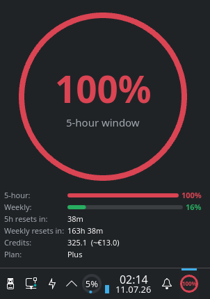

# Codex Usage KDE Widget

A KDE Plasma 6 widget that displays your [OpenAI Codex](https://github.com/openai/codex) rate-limit usage as a circular ring gauge, similar to the KDE CPU or Memory monitor widgets.



## Features

- Circular ring chart showing 5-hour window usage with percentage in the center
- Weekly usage bar
- Reset countdown timers
- Credit balance and plan type display
- Auto-refresh (configurable interval)
- Color-coded: blue (normal), yellow (>= 80%), red (limit reached)
- Configurable Codex binary path

## Prerequisites

You need **Codex** installed and logged in.

If codex is not on your `PATH` (e.g. managed by an editor like Zed), you can set its path in settings.

```

Verify both are accessible on your `PATH`:


[Configuration](#configuration) below.

## Installation

### From source

```bash
git clone <repo-url> codex_usage_kde
cd codex_usage_kde
./install.sh
```

The install script symlinks the widget into `~/.local/share/plasma/plasmoids/`.

### Manual

```bash
cp -r package ~/.local/share/plasma/plasmoids/com.github.codex.usage
```

Then restart Plasma to pick up the new widget:

```bash
systemctl --user restart plasma-plasmashell
```

## Usage

### Add to panel or desktop

1. Right-click your panel or desktop
2. Select **Add Widgets**
3. Search for **Codex Usage**
4. Drag it to your panel or desktop

### Test in a window

```bash
plasmawindowed com.github.codex.usage
```

### Configuration

Right-click the widget and select **Configure** to change:

- **Refresh interval** — how often to poll Codex for usage data (default: 300 seconds / 5 minutes)
- **Codex binary path** — full path to the codex executable (default: empty = auto-detect from `PATH`)

If codex is installed at a custom location (e.g. via Zed's npx cache):

1. Find the path: `whereis codex`
2. Right-click the widget → **Configure**
3. Paste the path, e.g. `/home/dee/.local/share/zed/node/cache/_npx/85780a441511e139/node_modules/.bin/codex`
4. Click **OK**

You can also set it via the `CODEX_BIN` environment variable when running the script manually:

```bash
CODEX_BIN=/path/to/codex bash package/contents/scripts/codex_usage.bash
```

### Refresh manually

Right-click the widget and select **Refresh Now**.

## How it works

The widget runs the bundled script `contents/scripts/codex_usage.bash` via Plasma's
`executable` data engine. The script:

1. Starts `codex app-server --listen stdio://` as a coprocess
2. Sends the JSON-RPC handshake (`initialize` / `initialized`)
3. Calls `account/rateLimits/read`
4. Extracts the relevant fields and outputs compact JSON to stdout

The QML widget parses that JSON and renders the circular gauge.

### JSON output format

```json
{
  "primary_used_percent": 100,
  "primary_window_minutes": 300,
  "primary_resets_at": 1783727503,
  "secondary_used_percent": 16,
  "secondary_window_minutes": 10080,
  "secondary_resets_at": 1784314303,
  "plan_type": "plus",
  "rate_limit_reached": "rate_limit_reached",
  "credits_balance": "411.5208125000",
  "credits_unlimited": false
}
```

## Development

### File structure

```
package/
├── metadata.json                         # Widget metadata (id, name, icon, category)
└── contents/
    ├── config/
    │   ├── config.qml                    # Config page tabs
    │   └── main.xml                      # Config schema (refreshInterval, codexBinaryPath)
    ├── scripts/
    │   ├── codex_usage.bash              # Fetches usage from codex app-server
    │   └── codex_usage_mock.bash         # Mock data for offline testing
    └── ui/
        ├── main.qml                      # Main widget (data fetching, state)
        ├── CircularGauge.qml             # Reusable ring gauge component
        ├── CompactRep.qml                # Panel compact representation
        ├── FullRep.qml                   # Expanded/desktop representation
        └── configGeneral.qml             # Config UI
```

### Testing without Codex installed

A mock script is bundled. To use it temporarily, edit `main.qml` and change
`codex_usage.bash` to `codex_usage_mock.bash` in the `scriptPath` property.

### Reload after changes

Since `install.sh` symlinks the package directory, edits are live immediately.
To apply QML changes:

```bash
systemctl --user restart plasma-plasmashell
```

Or for quick testing:

```bash
plasmawindowed com.github.codex.usage
```

## Troubleshooting

**Widget shows "!!"** — The script failed to run. Check that `codex` is
available and that you've run `codex login`. You can debug by running
the script manually:

```bash
bash ~/.local/share/plasma/plasmoids/com.github.codex.usage/contents/scripts/codex_usage.bash
```

Or with a custom codex path:

```bash
CODEX_BIN=/path/to/codex bash ~/.local/share/plasma/plasmoids/com.github.codex.usage/contents/scripts/codex_usage.bash
```

**Widget shows "—"** — Data is still loading or no data has been received yet.
Wait for the next refresh.

**Widget not found after install** — Restart Plasma:

```bash
systemctl --user restart plasma-plasmashell
```

## License

MIT
